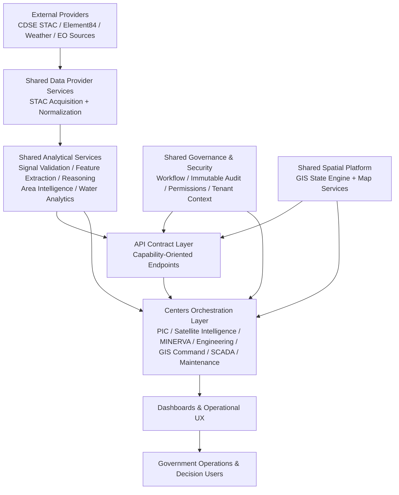

# DSP Official Architecture Blueprint

Date: 2026-07-16
Scope: Discovery + Architecture Refactoring Plan (no implementation)
Evidence rule: Repository evidence only. Any unproven statement is marked exactly as: Cannot verify.

---

## SECTION 1
## Current Centers

| Center | Business Responsibility | Evidence |
|---|---|---|
| Project Intelligence Center (PIC) | Project monitoring/intelligence from archive scenes, events, alerts, timeline | app/dashboard/gis-sovereignty/project-intelligence-center/page.tsx, lib/pic/analyzer.ts, app/api/v1/pic/projects/[id]/route.ts |
| Satellite Intelligence Center | Multi-panel satellite analysis (scene summaries, area analytics, workflows, map integration) | app/dashboard/gis-sovereignty/satellite-intelligence-center/page.tsx, app/dashboard/gis-sovereignty/satellite-intelligence-center/components/SatelliteIntelLegacyShell.tsx |
| Engineering Workspace | Asset/map editing, layer operations, engineering GIS workflows | app/dashboard/gis-sovereignty/engineering-workspace/page.tsx, app/dashboard/gis-sovereignty/engineering-workspace/components/* |
| GIS Command Center | Aggregated geospatial operations view and orchestration | app/dashboard/gis-sovereignty/command-center/page.tsx |
| MINERVA Center | Spatial intelligence command interface + Python intelligence integration path | app/dashboard/gis-sovereignty/minerva-center/page.tsx, app/dashboard/gis-sovereignty/minerva-center/command/CommandCenter.tsx, minerva/* |
| Maintenance Preventive Center | Water operations analytics and workbook-driven extraction/analysis | app/dashboard/admin-gateway/maintenance/preventive/page.tsx |
| Control Center SCADA | SCADA operational analytics using the same water extraction engines | app/dashboard/control-center/scada/page.tsx |
| Maintenance Workspace | Work-order/maintenance GIS-centric operations | app/dashboard/gis-sovereignty/maintenance-workspace/page.tsx |
| Remote Sensing Center (legacy alias) | Redirect-only shell to Satellite Intelligence Center | app/dashboard/gis-sovereignty/remote-sensing-center/page.tsx |
| Radar Center | Cannot verify | Cannot verify |
| Surveying Center | Cannot verify | Cannot verify |

---

## SECTION 2
## Shared Platform Services

| Shared Service (Engine) | Purpose | Current Location | Consumers (Observed) | Dependencies | Owner (Observed) | Should Be Shared Platform Service? | Duplicated Implementations | APIs That Should Disappear After Consolidation |
|---|---|---|---|---|---|---|---|---|
| STAC Acquisition Service (`searchSTAC`) | Unified EO scene discovery from CDSE/Element84 | lib/stac.ts | Satellite API routes; satellite analytics | External STAC providers | Satellite data provider layer | Yes | Partial duplication with route-local acquisition logic | Candidate overlap: app/api/gis/[...slug]/route.ts change endpoints vs app/api/v1/satellite/* |
| Change Indicators Service (`computeChangeIndicators`) | Standardized delta indicators from scene stats | lib/stac.ts | Satellite routes and derived analysis flows | STAC scene objects | Satellite data provider layer | Yes | Similar change logic appears in multiple routes | Candidate overlap: `/api/gis/[...slug]` change paths vs `/api/v1/satellite/*` monitors |
| Signal Validation Engine | Observation validation/confidence gating | lib/svqe/engine.ts | PIC analyzer | Scene observations | PIC intelligence pipeline | Yes | Cannot verify secondary duplicate class | Cannot verify |
| Feature Extraction Engine | Physical feature extraction from observations | lib/features/engine.ts | PIC analyzer | Signal outputs | PIC intelligence pipeline | Yes | Cannot verify secondary duplicate class | Cannot verify |
| Reasoning Engine (Construction) | Progress/health/interruption reasoning and explainability | lib/reasoning/engine.ts | PIC analyzer | Signal + feature outputs | PIC intelligence pipeline | Yes | Similar reasoning patterns outside engine: Cannot verify as equivalent logic | Cannot verify |
| Workflow Engine | Governance workflow lifecycle transitions | lib/governance/core.ts | Governance paths; workflow-related API domain integration | pgPool + governance schema | Governance core | Yes | Cannot verify duplicate workflow engine class | Cannot verify |
| Immutable Audit Service | Immutable audit append stream | lib/governance/core.ts | Security audit bridge and governance events | governance schema | Governance core | Yes | File-log parallel sink exists (`security_audit.log`) | Cannot verify |
| GIS State Engine (`useGisEngine`) | Shared cross-center GIS state + map orchestration primitives | store/gisEngine.ts | Command Center, Engineering Workspace, Satellite center, maintenance workspace, GIS panels | Zustand store + map tooling | GIS platform layer | Yes | Multiple center components orchestrate overlapping GIS workflows | Cannot verify |
| Area Intelligence Engine | Area-level satellite analytics aggregation | lib/areaIntelEngine.ts | Satellite center components | satelliteIntelAPI and scene contracts | Satellite intelligence layer | Yes | UI-level distributed analytic orchestration in multiple components | Cannot verify |
| Satellite Scene Summary Service | Scene/workflow summaries with fallback path | lib/satelliteIntelAPI.ts | Satellite center components | STAC-adjacent scene contracts | Satellite intelligence layer | Yes | Real/fallback dual path in same service surface | Candidate: fallback-driven scene paths should be isolated from production route contracts |
| Water Quality Engine | Water workbook extraction/analytics | lib/engines/waterQualityEngine.ts | Maintenance Preventive + SCADA | workbook ingestion path | Water domain engines | Yes | Yes (same engine consumed in two center pages directly) | Cannot verify |
| Well/Pump Engine | Well and pump extraction/analytics | lib/engines/wellFieldsPumpEngine.ts | Maintenance Preventive + SCADA | workbook ingestion path | Water domain engines | Yes | Yes (same direct consumption pattern across two centers) | Cannot verify |
| Branch/TAZ Water Engines | Branch-specific extraction/aggregation | lib/engines/easternBranchEngine.ts, lib/engines/centralBranchEngine.ts, lib/engines/tazEngine.ts | Maintenance Preventive + SCADA | workbook ingestion path | Water domain engines | Yes | Yes (same direct import pattern in both centers) | Cannot verify |
| Permission Service (`hasPermission`) | Role-permission and domain constraints | lib/permissions.ts | Authz flows and route-level authorization stack | permission provider model | Auth/governance layer | Yes | Cannot verify duplicate permission engine | Cannot verify |
| Tenant Context Service (`extractTenantId`) | Verified tenant header extraction for route security | lib/backendProxy.ts | v1 PIC routes and other protected paths | middleware-injected headers | Backend proxy layer | Yes | Cannot verify duplicate equivalent extractors across all routes | Cannot verify |

Notes on "APIs to disappear after consolidation":
- Proven overlap exists between GIS catch-all analysis endpoints and v1 satellite domain endpoints.
- Direct deletion candidates cannot be finalized from code evidence alone without contract/consumer inventory. Therefore endpoint deprecation decisions beyond overlap markers: Cannot verify.

---

## SECTION 3
## Capability Matrix

Legend: Required / Optional / Not Used / Cannot verify

| Shared Service | Radar | PIC | MINERVA | Satellite Intelligence | Engineering Workspace | GIS | Surveying |
|---|---|---|---|---|---|---|---|
| STAC Acquisition Service | Cannot verify | Optional | Required | Required | Optional | Optional | Cannot verify |
| Change Indicators Service | Cannot verify | Optional | Optional | Required | Optional | Optional | Cannot verify |
| Signal Validation Engine | Cannot verify | Required | Optional | Optional | Not Used | Not Used | Cannot verify |
| Feature Extraction Engine | Cannot verify | Required | Optional | Optional | Not Used | Not Used | Cannot verify |
| Reasoning Engine (Construction) | Cannot verify | Required | Optional | Optional | Not Used | Not Used | Cannot verify |
| Workflow Engine | Cannot verify | Optional | Optional | Optional | Optional | Optional | Cannot verify |
| Immutable Audit Service | Cannot verify | Optional | Optional | Optional | Optional | Optional | Cannot verify |
| GIS State Engine | Not Used | Optional | Optional | Required | Required | Required | Optional |
| Area Intelligence Engine | Cannot verify | Optional | Optional | Required | Optional | Optional | Cannot verify |
| Satellite Scene Summary Service | Cannot verify | Optional | Optional | Required | Not Used | Optional | Cannot verify |
| Water Quality Engine | Cannot verify | Not Used | Not Used | Not Used | Optional | Optional | Cannot verify |
| Well/Pump Engine | Cannot verify | Not Used | Not Used | Not Used | Optional | Optional | Cannot verify |
| Branch/TAZ Water Engines | Cannot verify | Not Used | Not Used | Not Used | Optional | Optional | Cannot verify |
| Permission Service | Cannot verify | Required | Required | Required | Required | Required | Cannot verify |
| Tenant Context Service | Cannot verify | Required | Required | Required | Required | Required | Cannot verify |

---

## SECTION 4
## Architecture Problems

### Duplicated Engines
- Water extraction engines are directly imported and executed in both Maintenance Preventive and SCADA pages.
- Evidence: app/dashboard/admin-gateway/maintenance/preventive/page.tsx and app/dashboard/control-center/scada/page.tsx.

### Duplicated APIs
- GIS catch-all (`/api/gis/[...slug]`) includes analysis endpoints that overlap with dedicated `/api/v1/satellite/*` domain endpoints (change/insar/trend-style capabilities).
- Evidence: app/api/gis/[...slug]/route.ts and app/api/v1/satellite/*.

### Duplicated Business Logic
- Satellite center orchestrates analytics across many UI components rather than a single center-level orchestration service boundary.
- Evidence: app/dashboard/gis-sovereignty/satellite-intelligence-center/components/SatelliteIntelLegacyShell.tsx plus broad related component usage.

### Duplicated Reports
- Single shared report engine that governs all center report outputs: Cannot verify.

### Duplicated Timeline Logic
- Platform-wide unified timeline engine with all centers as consumers: Cannot verify.

### Duplicated Evidence Logic
- Evidence persistence/representation appears split across DB and local files by domain; a single evidence contract engine covering all centers is not proven.
- Evidence: lib/picDB.ts, app/api/gis/[...slug]/route.ts, lib/security-audit-log.ts.

### Duplicated Satellite Logic
- Real/fallback scene summary logic coexists in the same service surface.
- Evidence: lib/satelliteIntelAPI.ts (allowSceneFallback, WORKFLOW_FALLBACK_PROFILES, buildFallbackSceneSummary).

---

## SECTION 5
## Target Architecture

Target principle:
- DSP is one platform.
- Centers orchestrate.
- Shared services execute.
- Every analytical capability exists exactly once.

Target organization (blueprint):
1. Shared Data Providers Layer
- STAC service, provider adapters, acquisition normalization.

2. Shared Analytical Services Layer
- Signal validation, feature extraction, reasoning, timeline, evidence, prediction, report, alert services.
- In current repository, timeline/evidence/prediction/report/alert as single platform-wide services: Cannot verify.

3. Shared Governance & Security Layer
- Workflow, immutable audit, permissions, verified tenant context.

4. Shared Spatial Platform Layer
- GIS state/service adapters and map orchestration primitives.

5. Centers Orchestration Layer
- PIC, Satellite Intelligence, MINERVA, Engineering, GIS Command, Maintenance/SCADA compose shared services only.
- Center-specific logic limited to mission orchestration and user workflows.

6. API Contract Layer
- Domain API surfaces map 1:1 to shared service contracts.
- Overlapping GIS/satellite analytical APIs are consolidated behind single capability contracts.

Target architecture statement:
- After consolidation, no center owns independent analytical engine implementations when equivalent shared service exists.
- Duplicate center-level analytical execution paths are removed in favor of platform service consumption.

---

## SECTION 6
## Migration Plan

### Priority P0 (Boundary and Contract Stabilization)
1. Define canonical shared-service boundaries from existing engines
- Risk: low-medium
- Dependencies: architecture governance approval
- Estimated impact: high clarity, immediate reduction of cross-center ambiguity

2. Freeze overlap map for GIS catch-all vs v1 satellite APIs
- Risk: medium
- Dependencies: endpoint inventory and consumer traceability
- Estimated impact: high, prevents further API drift

3. Freeze direct center-level engine imports list (water + satellite panel orchestration hotspots)
- Risk: low
- Dependencies: consumer inventory
- Estimated impact: high for duplication control

### Priority P1 (Service Consolidation Plan)
1. Consolidation blueprint for satellite capability stack
- Risk: medium-high
- Dependencies: stable STAC + summary contracts
- Estimated impact: high (largest duplication domain)

2. Consolidation blueprint for water analytics engines into a shared platform service surface
- Risk: medium
- Dependencies: workbook format and extraction contract baseline
- Estimated impact: high for maintenance/SCADA consistency

3. Governance service adoption map across centers (workflow/audit/permission/tenant)
- Risk: medium
- Dependencies: route-level authz matrix
- Estimated impact: high for government readiness

### Priority P2 (API Rationalization Plan)
1. Define consolidated endpoint ownership model (capability-based API taxonomy)
- Risk: medium
- Dependencies: P0 overlap map
- Estimated impact: high for maintainability

2. Mark deprecation candidates among overlapping GIS/satellite analytical endpoints
- Risk: medium-high
- Dependencies: runtime usage telemetry and consumer map
- Estimated impact: medium-high

3. Separate fallback/simulated paths from production analytical contracts
- Risk: medium
- Dependencies: explicit contract tagging policy
- Estimated impact: high for audit traceability

### Priority P3 (Maturity and Readiness Hardening)
1. Introduce architecture conformance scorecard per center (orchestration-only compliance)
- Risk: low
- Dependencies: agreed scoring rubric
- Estimated impact: medium

2. Multi-tenant readiness verification pack per shared service
- Risk: medium
- Dependencies: route-service dependency matrix
- Estimated impact: high for government scale-up readiness

3. Unified evidence/timeline/report shared engines roadmap
- Risk: Cannot verify (service completeness not proven)
- Dependencies: Cannot verify
- Estimated impact: high if feasible

---

## SECTION 7
## Architecture Diagram

---

## Evidence Index (Primary)
- app/dashboard/gis-sovereignty/page.tsx
- app/dashboard/gis-sovereignty/project-intelligence-center/page.tsx
- app/dashboard/gis-sovereignty/satellite-intelligence-center/page.tsx
- app/dashboard/gis-sovereignty/satellite-intelligence-center/components/SatelliteIntelLegacyShell.tsx
- app/dashboard/gis-sovereignty/engineering-workspace/page.tsx
- app/dashboard/gis-sovereignty/command-center/page.tsx
- app/dashboard/gis-sovereignty/minerva-center/page.tsx
- app/dashboard/admin-gateway/maintenance/preventive/page.tsx
- app/dashboard/control-center/scada/page.tsx
- app/api/gis/[...slug]/route.ts
- app/api/v1/satellite/*
- app/api/v1/pic/projects/[id]/route.ts
- lib/stac.ts
- lib/satelliteIntelAPI.ts
- lib/pic/analyzer.ts
- lib/svqe/engine.ts
- lib/features/engine.ts
- lib/reasoning/engine.ts
- lib/governance/core.ts
- lib/security-audit-log.ts
- lib/permissions.ts
- lib/backendProxy.ts
- store/gisEngine.ts
- minerva/*

---

## Explicit Cannot verify Register
- Radar center runtime architecture and concrete service consumption matrix from inspected code surface: Cannot verify.
- Surveying center runtime architecture and concrete service consumption matrix from inspected code surface: Cannot verify.
- Single shared Timeline Engine implementation consumed across all centers: Cannot verify.
- Single shared Evidence Engine implementation consumed across all centers: Cannot verify.
- Single shared Report Engine implementation consumed across all centers: Cannot verify.
- Single shared Prediction Engine implementation consumed across all centers: Cannot verify.
- Exact endpoint-level deprecation list guaranteed safe for immediate removal without runtime consumer impact analysis: Cannot verify.
